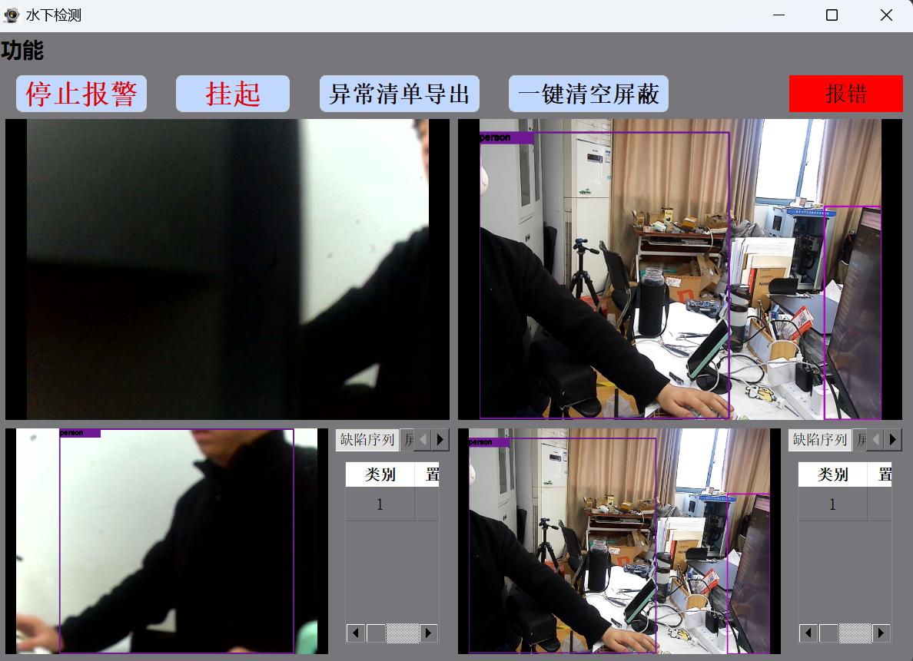

# YOLOv8——水下检测项目
### 水下检测软件界面



> ├── main.py                     # 主程序入口
> ├── params.json                 # 系统配置文件（程序首次运行会自动生成）
> ├── log.txt / log_ip.txt        # 运行日志与网络配置日志
> ├── src/
> │   ├── ui/                     # PyQt5 UI 界面转换后的 Python 文件
> │   │   ├── main_window_end.py
> │   │   ├── menu_setting.py
> │   │   └── menu1.py
> │   └── qt/
> │       └── stream/             # 核心工作线程
> │           ├── video_capture.py    # 摄像头捕获线程
> │           ├── visualize.py              # 图像渲染与UI更新线程
> │           ├── ai_worker.py           # AI 目标检测工作线程
> │           ├── ai_find_circle.py     # AI 圆形标定辅助线程
> │           ├── modbus.py             # Modbus 硬件通讯线程
> │           └── floder_clean_up.py  # 自动清理历史图片/视频的线程
> ├── save_picture/               # 存放自动保存的正常抓拍图片
> ├── error_picture/              # 存放检测到缺陷时的异常截图
> └── weights/                    # AI 模型权重文件存放目录 (如 .pt 或 .onnx)

**注意事项**

- 使用的模型格式为onnx。
- 目前检测的缺陷类型为旋涡（vortex）、异常出丝（abnormal）、漏油（oil）。
- 连接的摄像头为USB/RTSP推流网络摄像头，默认输入源为0。
- 在params.json中更改检测的对象和模型位置等参数。


## 安装

安装所需包：

```shell
pip install PyQt5 opencv-python numpy pandas openpyxl
```

## 运行

```shell
python main.py
```

## 打包
使用PyInstaller打包：

```shell
pyinstaller -w main.py --icon="icon.ico" --exclude-module PyQt6 --exclude-module PySide2 -y 
```
