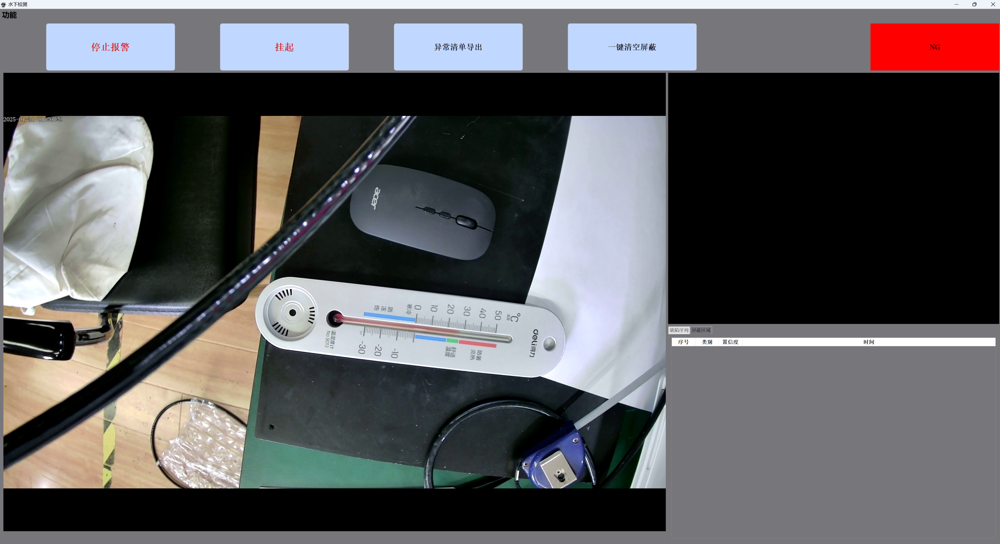

# YOLOv8——水下检测项目
水下检测软件界面



**注意事项**

- 使用的模型格式为onnx。
- 目前检测的缺陷类型为旋涡（vortex）、异常出丝（abnormal）、漏油（oil）。
- 连接的摄像头为USB/RTSP推流网络摄像头，默认输入源为0。


## 安装

安装所需包：

```shell
pip install -r requirements.txt
```

## 运行

```shell
python main.py
```

